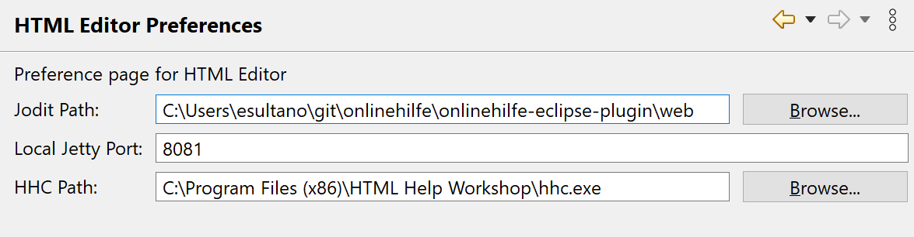
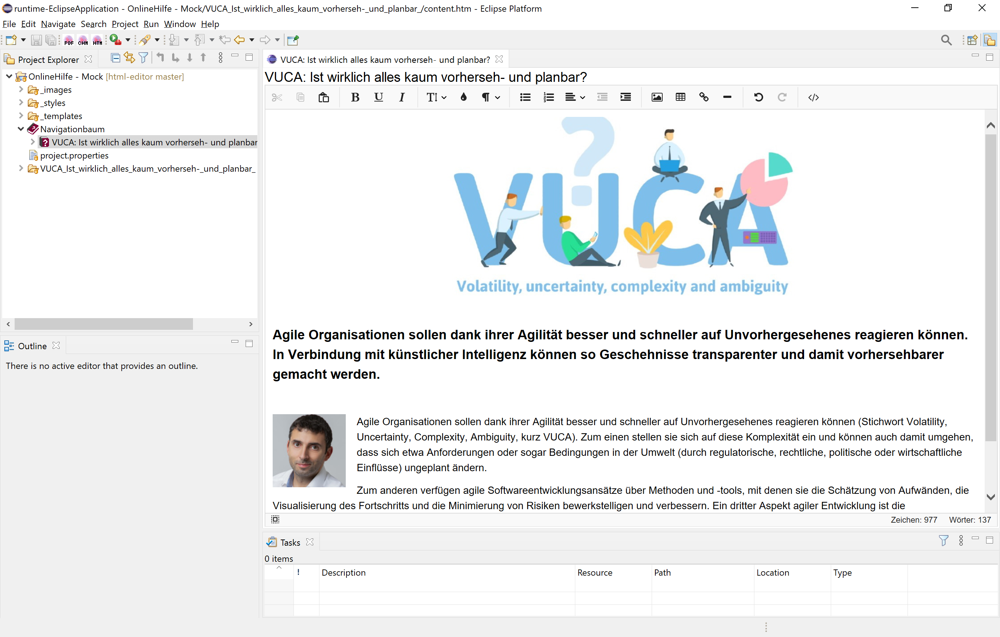

# html-editor
In the form of an an Eclipse E4 Rich Client, this project provides a WYSIWYG HTML editor based on [Jodit](https://www.npmjs.com/package/jodit). It features an export function for the output formats PDF, CHM, and HTML.

## Prerequisites
### Java
Download OpenJDK version 14 (or higher) and extract it into *C:\Development\java\jdk-14.0.2* (you may use a different folder).
Set set environment variable `JAVA_HOME=C:\Development\java\jdk-14.0.2` and add `%JAVA_HOME%\bin` to the *Path* environment variable.

### Maven
Download Maven version 3.6.3 (or higher) and extract it into *C:\Development\apache-maven-3.6.3* (you may use a different folder).

```bash
cd C:\Users\esultano\git\html-editor\
mvn clean install
```

### HTML Help Workshop
Download and install [HTML Help Workshop](https://www.microsoft.com/en-us/download/details.aspx?id=21138).

## Run it
In Eclipse run *onlinehilfe product.launch*. Then under *Window / Peferences / HTML Editor Preferences* set the following preferences:



Then import the mock: *File / Import... / Existing Projects into Workspace /*, select the root directory *C:\Users\esultano\git\html-editor\workspace-mock* and finally select the project *OnlineHilfe - Mock* and click *Finish*.


